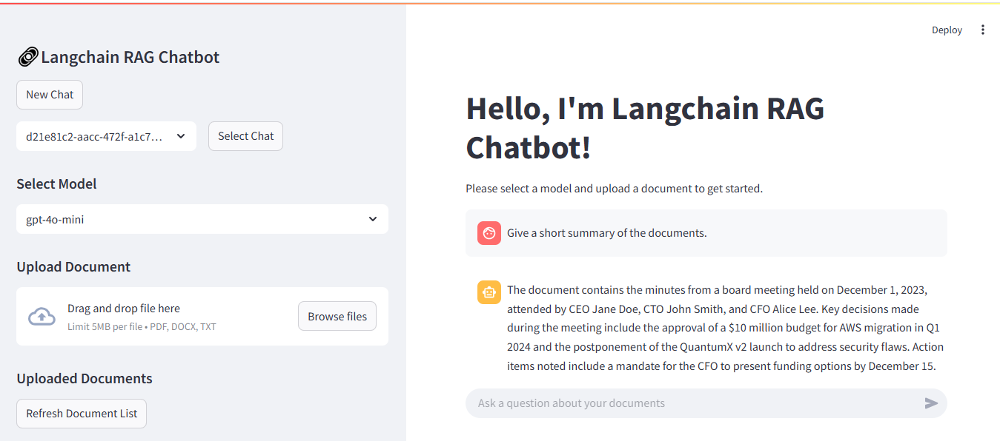
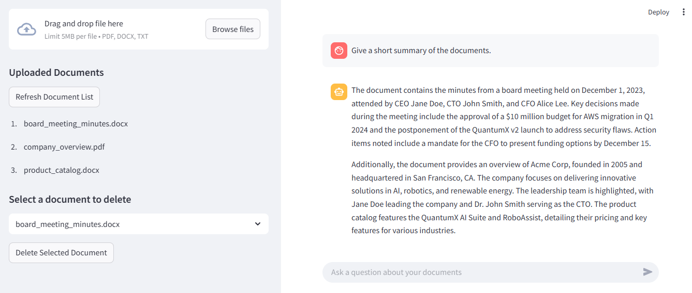

# 🤖 Langchain-RAG-Chatbot

A powerful and context-aware RAG (Retrieval-Augmented Generation) chatbot built with [Langchain](https://python.langchain.com/docs/get_started/introduction), [ChromaDB](https://docs.trychroma.com/), and [FastAPI](https://fastapi.tiangolo.com/), featuring a modern [Streamlit](https://docs.streamlit.io/) GUI interface.

## 🚀 Features

- **Context-Aware Conversations**: Maintains chat history and context for more coherent and relevant responses
- **Session Management**: Unique session IDs for each chat conversation
- **Vector Database**: Efficient document storage and retrieval using ChromaDB
- **Modern GUI**: User-friendly Streamlit interface for seamless interaction
- **RESTful API**: FastAPI backend with comprehensive API documentation
- **Multiple LLM Support**: Flexible model selection with OpenAI integration
- **Document Processing**: Efficient document ingestion and vectorization
- **Asynchronous Architecture**: Built with FastAPI for high performance
- **SQLite Database**: Persistent storage for chat history and session management

## 💻 Technologies Used

- **Backend**: FastAPI, Langchain
- **Vector Database**: ChromaDB
- **Database**: SQLite
- **Frontend**: Streamlit
- **LLM Integration**: OpenAI API
- **Document Processing**: Langchain Document Loaders

## 📋 Prerequisites

Before you begin, ensure you have the following installed:

- **Python 3.12+** - Required for async features and modern Python syntax
- **pip** - Python package installer
- **Git** (optional) - For cloning the repository

## 📦 Setup

1. **Clone the repository**

   ```bash
   git clone [repository-url]
   cd Langchain-RAG-Chatbot
   ```

2. **Create and activate a virtual environment**

   - Windows:
     ```bash
     python -m venv venv
     venv\Scripts\activate
     ```
   - Linux/macOS:
     ```bash
     python3 -m venv venv
     source venv/bin/activate
     ```

3. **Install dependencies**

   ```bash
   pip install -r requirements.txt
   ```

4. **Set environment variables**
   Rename `env.example` to `.env` and update with your OpenAI API key

   ```
   OPENAI_API_KEY=your_api_key_here
   ```

5. **Run the application**

   Start the FastAPI backend:

   ```bash
   uvicorn app.main:app --reload --reload-dir ./app
   ```

   In a separate terminal, start the Streamlit GUI:

   ```bash
   streamlit run gui/main.py
   ```

## Screenshots




## 📚 API Documentation

The API documentation is available at:

- Swagger UI: `http://localhost:8000/api/v1/docs`
- ReDoc: `http://localhost:8000/api/v1/redoc`

## 🔄 RAG Architecture

The system implements a sophisticated RAG pipeline:

1. **Document Processing**:

   - Document ingestion and chunking
   - Vectorization using embeddings
   - Storage in ChromaDB

2. **Retrieval System**:

   - Context-aware retrieval using chat history
   - Semantic search with configurable k-nearest neighbors
   - Efficient vector similarity search

3. **Generation Pipeline**:

   - History-aware question reformulation
   - Context integration with retrieved documents
   - LLM-powered response generation

4. **Session Management**:
   - Unique session IDs for each conversation
   - Persistent chat history
   - Context maintenance across sessions

## 🎯 Key Components

### Backend (FastAPI)

- RESTful API endpoints for chat and document management
- Asynchronous request handling
- Session management and persistence
- Document processing and vectorization

### Vector Store (ChromaDB)

- Efficient document storage and retrieval
- Vector similarity search
- Persistent storage of embeddings

### Frontend (Streamlit)

- Modern and intuitive chat interface
- Real-time chat updates
- Document upload and management
- Session management UI

## 🔧 Environment Variables

Required environment variables in `.env`:

- `OPENAI_API_KEY`: Your OpenAI API key

## 📝 License

This project is licensed under the [MIT License](./LICENSE).

## 🤝 Contributing

Contributions are welcome! Please feel free to submit a Pull Request.

**Note**: This project is inspired by a YouTube tutorial series by **Pradip Nichite**, available [here](https://www.youtube.com/watch?v=38aMTXY2usU).
